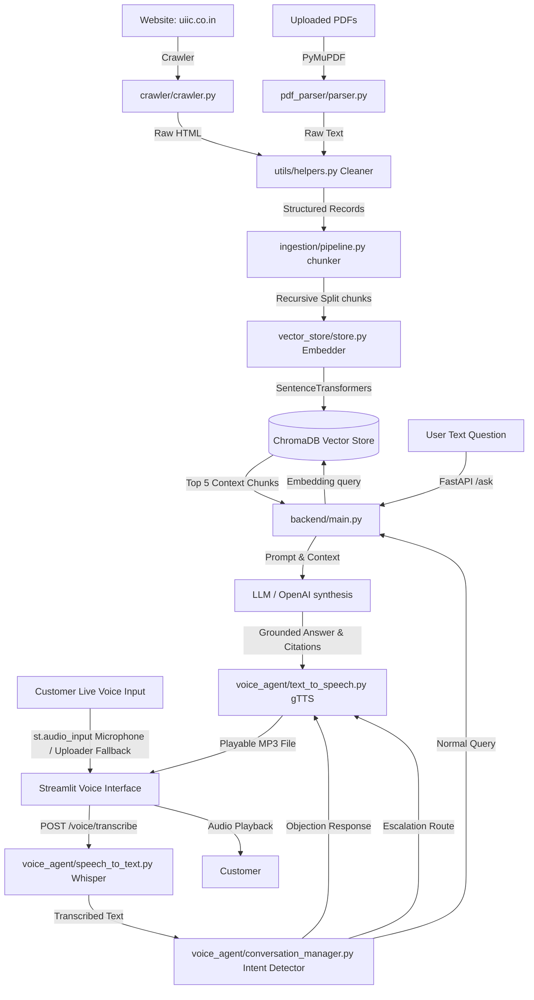

# System Architecture Documentation

This document explains the technical layout, components flow, and search priority guidelines.

## Ingestion & Retrieval Pipeline

## Component Breakdown

1. **Website Crawler (`crawler/crawler.py`):** Automatically traverses internal domain paths, ignoring cookies, careers, privacy pages, and identifies PDF download links.
2. **PDF Parser (`pdf_parser/parser.py`):** Uses PyMuPDF to extract text layout, titles, sections, and page numbers from files.
3. **Data Cleaning & Masking (`utils/helpers.py`):** Standardizes paragraph text, corrects formatting glitches, removes menu bars, and redacts PII (Emails, Phones, SSNs).
4. **Vector Store (`vector_store/store.py`):** Loads `SentenceTransformer('all-MiniLM-L6-v2')` to translate text to 384-dimensional dense embeddings and manages ChromaDB persistent indexes.
5. **Ingestion Orchestrator (`ingestion/pipeline.py`):** Combines crawling and parsing to chunk contents into 500-character segments (100-character overlaps) with comprehensive metadata attachments.
6. **Query Service (`backend/main.py`):** Exposes FastAPI routes resolving inputs against vector indices, applying search priority filters, and validating answer relevance to prevent hallucinations.
7. **Speech to Text (`voice_agent/speech_to_text.py`):** Implements local Whisper ASR models transcribing audio stream waveforms.
8. **Conversation Manager (`voice_agent/conversation_manager.py`):** Filters intents (escalations, objections, normal insurance policies) and integrates directly with RAG matching indices.
9. **Text to Speech (`voice_agent/text_to_speech.py`):** Translates text answers to playable audio MP3 formats using gTTS.

## Search Priority Guidelines

To resolve conflicting data definitions, retrieved chunks are ranked and queried following priority rules:
1. **Policy PDF Documents:** Gold standard context references.
2. **Official Website FAQ pages:** Core regional policy details.
3. **Official Product Pages:** General terms.
4. **Brochures:** Informational marketing brochures.
